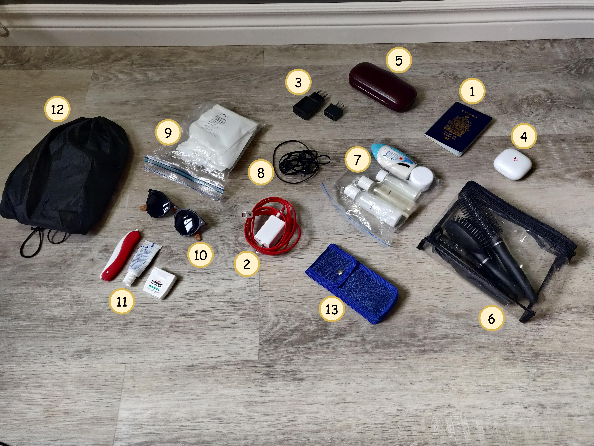

## Introduction
In this blog post, I'll give my thoughts on what to pack for a backpacking trip in Europe, supported by my recent experience. My friends and I recently did a 19-day backpacking trip in Europe from May 1st to May 19th, starting in Lisbon, Portugal and ending in Rome, Italy. These are all the cities we stayed in:

1. Lisbon, Portugal
2. Madrid, Spain
3. Barcelona, Spain
4. Marseille, France
5. Monaco
6. La Spetzia, Italy
7. Rome, Italy

We typically stayed in cities for 2-3 days in Airbnbs, and travelled by train with an eurail&trade; pass. We were constantly on the move, so packing light and simple is key. Let's start with the type of luggage that I brought.

### What Luggage to Bring
Ideally, you’ll want to avoid bringing a checked bag on a backpacking trip because you’ll be on the move often so wheeling a suitcase between airbnbs and train stations will be a bit of a hassle. That leaves you with one large carry-on and one personal item, which most airlines let you take on a plane at no additional cost. 

The carry-on luggage should ideally be a large backpack so you don’t have to wheel it around. The personal item should be a small backpack, fanny pack, or other bag that you can keep on your back or front with one or two straps. Make sure you can also equip this bag in front of you so that you can have both your backpack on your back and your personal item on your front. 

Here are some numbers on allowable dimensions for luggage when flying with Air Transat. Make sure to look up the numbers for the airline you’re flying with, because they may be slightly different.

### Backpack
Here is the [17 inch travel backpack](https://amzn.to/3Wpc2F9) that I bought off Amazon and used. It had plenty of space for roughly 5 days of clothes and everything else I needed to pack.





### Personal-Item Bag
I found this sling bag at a local Marshalls which I used as my personal-item bag. When I left my backpack at the airbnbs, I'd take this bag with me on day trips.

However, I **don't recommend** getting this bag if you happen to find the exact same one! It was just big enough to fit my tall 24oz water bottle, but with such little remaining room that the zipper eventually broke from me closing it with force many times. Therefore, I'd recommed getting a bigger bag that can comfortably hold the water bottle size you're bringing. It's a good idea to get a 32oz or 1 litre water bottle, since I found that 24oz was not enough to last me for entire day trips; this was especially true during our hike in Calanques National Park, France.

I would recommend getting a larger sling bag. Although I haven't tried this [sling bag](https://amzn.to/3MrHGNA) myself, I found it on Amazon and it looks like it'd get the job done:




What things might you want to put in your new personal bag? Well, you might want:
* Snacks / protein bars
* Water bottle
* Smartphone
* Wallet with money
* Wireless headphones
* Wired headphones (for listening to movies on the built-in consoles on planes)
* Sunglasses
* Toothbrush and toothpaste (I needed these because I have clear braces)
* Passport
* Sunscreen
* Portable charger

### What Belongings to Bring
Here is everything that I brought with me on the trip, minus clothes and other things noted below:

1. Canadian passport
2. Phone charging brick and cable - I didn't use the charing brick because it has a North American plug, but I used the USB-A to USB-C cable.
3. European plug adapter (220 volt) with USB-A - European plugs have only 2 prongs (never 3) with widely-spaced circular pins.
4. Wireless earbuds - Beat Fit Pros
5. Prescription glasses in their case
6. Hair grooming kit
    * Comb
    * Travel brush
    * Travel round brush
    * Electric shaver (just because it fits in the bag nicely)
7. Liquids bag - contains bottles of size 100ml or smaller, with a maximum total volume of 1 litre.
    * Shampoo
    * Conditioner
    * Body wash
    * Moisturizer
    * Allergy medication
8. Wired headphones - for listening to movies on the plane
    * **Note**: You will need wired headphones because most plane built-in screens have an AUX port for audio.
9. Spark&trade; aligners - I have braces at the moment
10. Sunglasses
11. Dental hygeniene stuffs
    * Portable toothbrush
    * Travel toothpaste
    * Floss
12. Bag with an additional pair of casual shoes

Other things not shown in the picture above:
* 24oz water bottle
* Razor for shazing
    * I should have brought this for a cleaner shave since the electric razor didn't cut short enough
* 5 days of clothes
    * shorts: chino shorts, jean shorts
    * pants: a single pair of jeans
    * shirts: a couple henleys, a polo, some t-shirts (at least one collared shirt for special occasions)
    * underwear: 6 pairs of underwear
    * socks: 6 pairs of socks
    * belt: a belt to prevent my pants from falling down
* Wallet

Notice that I didn't bring a big bulky pair of headphones. My Beats Fit Pro&trade; got the job done when it came to listening to music and podcasts, and they have noise cancellation which was very useful during the plane rides.

### Bring a Wallet
I highly recommend bringing a wallet to store your cash in when travelling around Europe. Before we left, I exchanged some CAD for &euro;500 which lasted me for the 19 days we were travelling. You can also pay for things using credit (VISA or Mastercard) if it's accepted. If the currency of purchase is different than the currency of your credit card's account, then there will be a small foreign trasaction fee of 1% to 3% for conversion. [1] In my opinion this fee is small enough to where I'd sometimes purchase pasteries or make other small transactions using my credit card(s) for convenience.

But, I decided not to bring a wallet to store my Euros, and instead elected to put them in a change pouch in my personal bag. I think this was a **mistake**. I comfortably spent &euro;400 before the finals days of our trip, and on the last day of the trip I managed to lose the remaining &euro;100 somehow. At one point in the afternoon I had all my bills, and then when I checked later in the evening I noticed all my bills were gone. This was after the main zipper on my personal bag had broken, but the change pouch zipper was still intact. Either a crafty pickpocket took the money, or it had fallen out in the case that I had forgotten to close the money pouch zipper. In either case, the broken main zipper on the personal bag definitely contributed to the probability that I'd lose my money. 

So my advice to you is: either bring a wallet that you can store your cash in and keep it in your pocket, or store the cash in your personal bag but keep it in front of you so that it is easier to keep track of.

Those were all my thoughts on packing for a backpacking trip in Europe. Bon voyage!

# References
[1] [https://www.valuepenguin.com/credit-card-foreign-transaction-fees](https://www.valuepenguin.com/credit-card-foreign-transaction-fees)
