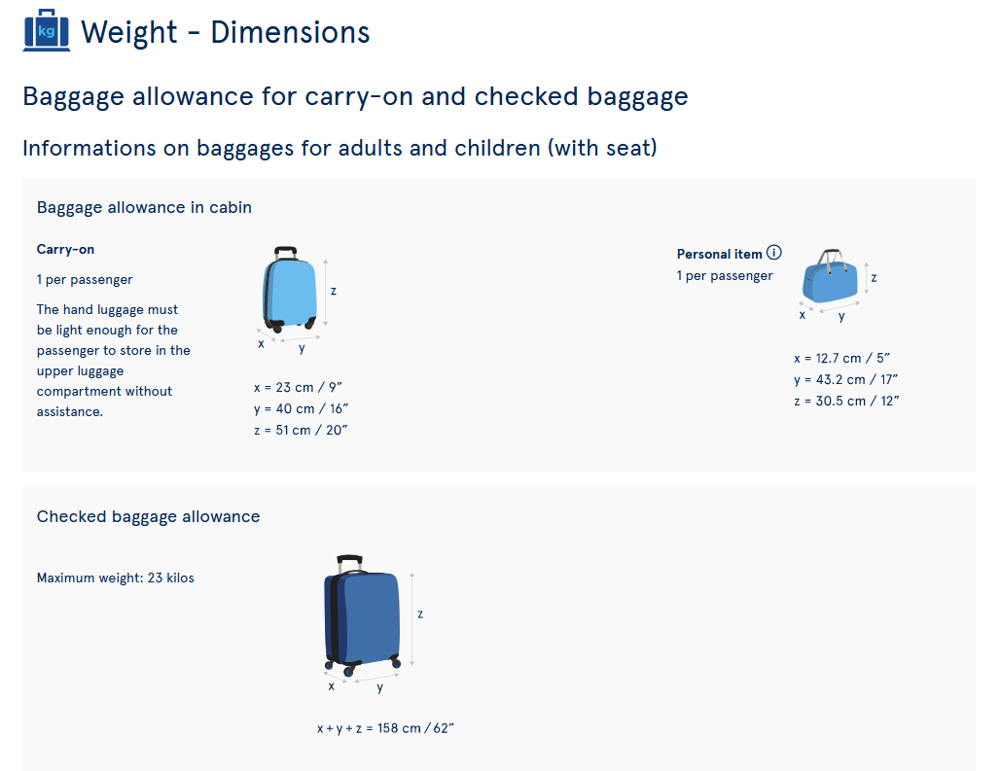
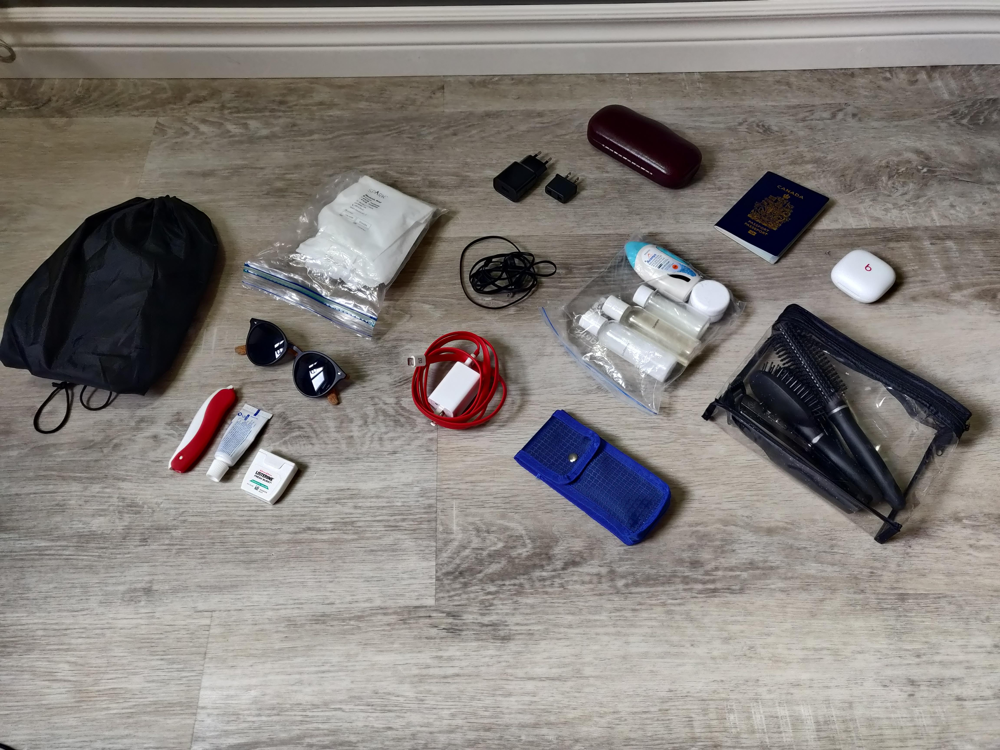
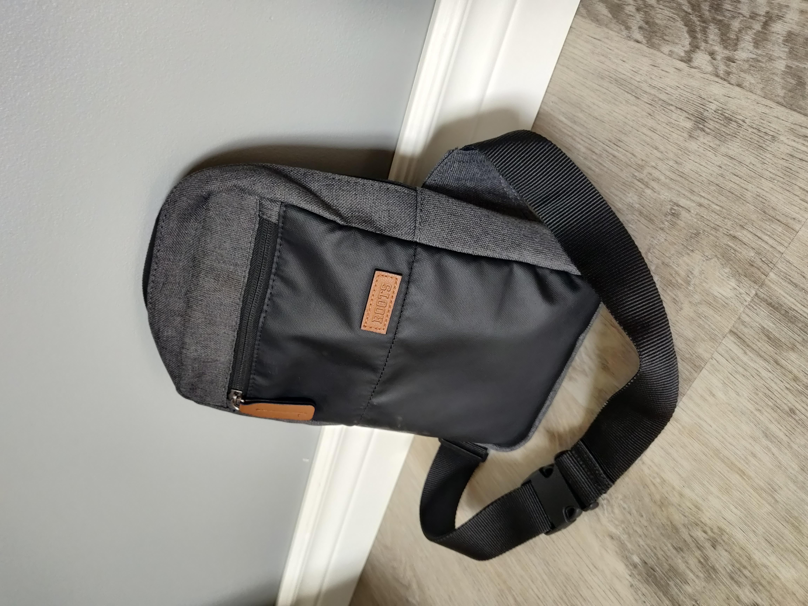
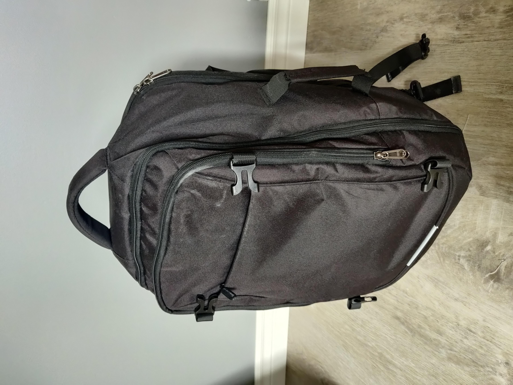

### Outline
- Suitcase items (travel sized stuff + clothes for 5 days)
- EU Rail pass (5 travel days)
    - Adding journeys or using the travel days without journeys
    - Caveats to the pass
    - Booking seat reservations
    - Spain does not allow you to book seat reservations online. Must use Renfe in person. Do bookings for *leaving* Spain as soon as you get to Spain so that seats do not sell out on the train you want to take.
- Personal item backpack.
    - Include picture of dimensions from air transat app.
    - Take something big enough to fit a 36oz water bottle.
- **Bring a wallet.** Even if you're like me and use only cards, no cash, you'll use cash often in Europe.
    - Keep the wallet in your pocket or store it in your personal bag in a small compartment which you can keep track of so that it is not pickpocketed or lost by accident.
    - I lost 100€ on my last day in Rome. It was stored in a pocket with a zipper and then another zipper that was broken. It was either stolen or it fell out.

In this blog post, I’ll show you how to prepare for a backpacking trip in Europe, including what/how much to pack, how to travel once you get to Europe, and some a couples things to avoid based on personal experience. Speaking of personal experience: from May 1st to May 19th, 2023, I backpacked across western Europe with a few friends. 

Let’s start with how much luggage you should bring!

### Luggage

Ideally, you’ll want to avoid bringing a checked bag on a backpacking trip because you’ll be on the move often so wheeling a suitcase between airbnbs and train stations will be a bit of a hassle. That leaves you with one large carry-on and one personal item, which most airlines let you take on a plane at no additional cost. 

The carry-on luggage should ideally be a large backpack so you don’t have to wheel it around. The personal item should be a small backpack, fanny pack, or other bag that you can keep on your back or front with one or two straps. Make sure you can also equip this bag in front of you so that you can have both your backpack on your back and your personal item on your front. 

Here are some numbers on allowable dimensions for luggage when flying with Air Transat. Make sure to look up the numbers for the airline you’re flying with, because they may be slightly different.

And here is the [17 inch travel backpack](https://amzn.to/3Wpc2F9) that I bought off Amazon and used. It had plenty of space for roughly 5 days of clothes and everything else I needed to pack.





