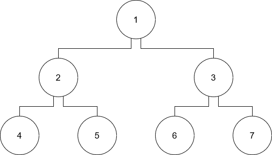
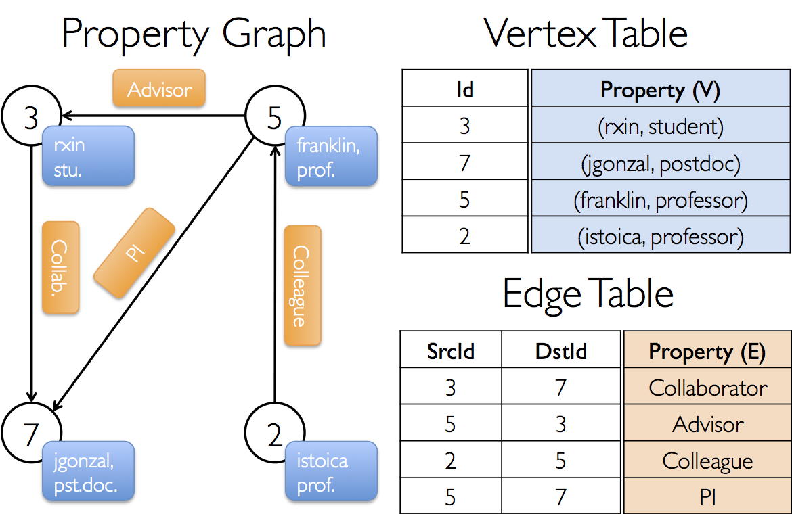
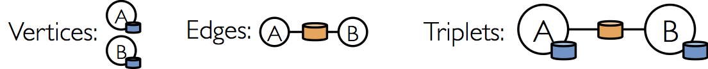

Spark is an efficient and easy-to-use framework for solving big data problems, and its Dataframe API allows solutions to be formatted in a familiar SQL syntax. However, the Dataframe API does not support the `recursive` SQL functionality, which is often used for a class of graph and tree algorithms.

Let’s look at an example problem and how we might solve it using recursive SQL, and then think about how to translate this into a Spark program.

## The Problem

Let’s say we have a directed tree data structure stored in a text file representing an edge list. Our file is called `graph.csv` and has the schema `[node_id: int, parent_id: int]`.

**`graph.csv`**

```text
2,1
3,1
4,2
5,2
6,3
7,3
```

This file represents the following directed, unweighted tree:



Our task is to build a list of all possible ancestor/descendant relationships between nodes. For example, `4` is a descendant of `1` and `1` is the ancestor of `4`. However, `3` is not an ancestor of `4`. 

Now assume that we want to use SQL to solve this problem and our `Graph` is actually stored in an SQL table named `Graph` with columns `node` and `parent`. The recursive SQL implementation looks like this:

``` sql
WITH RECURSIVE Relationship(anc, des) AS (
		SELECT parent AS anc, node AS des
		FROM Graph
	UNION
		SELECT Relationship.anc AS anc, Graph.node AS des
		FROM Relationship, Graph
		WHERE Relationship.des = Graph.parent
)
```

This results in a table named `Relationship` with columns `anc` and `des`, where each row represents an ancestral relationship between two nodes. In our example, the `Relationship` table will look like this after the recursive SQL algorithm converges:

| anc | des |
| --- | --- |
| 1 | 2 |
| 1 | 3 |
| 1 | 4 |
| 1 | 5 |
| 1 | 6 |
| 1 | 7 |
| 2 | 4 |
| 2 | 5 |
| 3 | 6 |
| 3 | 7 |

From this table, it’s clear that `1` is the ancestor of every other node. Also notice that `(3, 4)` is not a row, so the nodes `3` and `4` have no relationship to each other. Finally, `1` never appears in the descendant column, so `1` has no ancestors.

## SQL Recursion Details

So why did we have to use recursive SQL to solve this problem? Well, without recursion we can only express ancestors in a SQL query at a *fixed degree* like 1st degree, 2nd degree, etc. In order to get all ancestors of arbitrary degree, we must take advantage of recursive SQL. Internally, the SQL engine will run something called a “Fixed Point” computation. Therefore, `RECURSIVE T AS Q` has the following semantics:

$$
T_0 = \empty \\\
T_1 = Q \text{ (but use } T_0 \text { for } T \text {)} \\\
T_2 = Q \text{ (but use } T_1 \text { for } T \text {)} \\\
\text{... until } T_i = T_{i+1}
$$

We start with an empty result table (`Relationship`). We then run the query for the first time, generating the 1st degree ancestors, which is just the `Graph` table itself. Notice that the query had two parts: a base case and a recursive case which were `UNION`'d together. The `Relationship` table is initially empty, so the recursive case generates no output on the first iteration. Only the base case generates a table, which is just the `Graph` table. Then, all subsequent iterations use the previous `Relationship` table of `i`-degree ancestors to generate the `i+1`-degree ancestors, which are put into the `Relationship` table again. Effectively, this transforms ancestors of degree `1 → 2, 2 → 3`, etc., so we need the `UNION` with the base case to re-introduce the ancestors of degree `1`. Once we reach an iteration where the `Relationship` table no longer changes, we stop. 

Now, how can we replicate this functionality using Spark?

## Spark Algorithm #1 - DataFrame Fixed Point Computation

Currently, Spark SQL does not support recursive SQL, so we can’t express this computation directly by either copy-and-pasting the SQL query into the `.sql()` function or by using the more programmatic Dataframe functions (e.g. `.select()`, `.where()`, etc.).

But… we know the “secret sauce” that SQL uses to get recursion in the form of “Fixed Point” computation, so we can mirror this approach in Spark.

**`ancestors.scala`**

```scala
import org.apache.spark.sql.{SparkSession, Row}
import org.apache.spark.sql.types._
import util.control.Breaks._

object AncestorsApp {
  def main(args: Array[String]) {
    val spark = SparkSession.builder.appName("AncestorsApp").getOrCreate()
    import spark.implicits._

    val graphSchema = StructType(Array(
      StructField("node", IntegerType, false),
      StructField("parent", IntegerType, false)
    ))

    val relationshipSchema = StructType(Array(
      StructField("anc", IntegerType, false),
      StructField("des", IntegerType, false)
    ))
  
    val graph = spark.read.schema(graphSchema).csv("graph.csv")
    var relationship = spark.createDataFrame(spark.sparkContext.emptyRDD[Row], relationshipSchema)

		// Run the above SQL query to generate ancestors until the dataset reaches a fixed point
    breakable {
      while (true) {
        val nextRelationship = graph
          .select($"parent".alias("anc"), $"node".alias("des"))
          .union(
            relationship.join(graph, $"des" === $"parent").select($"anc", $"node".alias("des"))
          )
        
        // If the dataset has not changed in this iteration, then break
        if (nextRelationship.except(relationship).count() == 0) { break }
        else { relationship = nextRelationship }
      }
    }

    relationship.show()

    spark.stop()
  }
}
```

This produces the output:

```
+---+---+
|anc|des|
+---+---+
|  1|  2|
|  1|  3|
|  2|  4|
|  2|  5|
|  3|  6|
|  3|  7|
|  1|  5|
|  1|  4|
|  1|  7|
|  1|  6|
+---+---+
```

which is the same as the table we expected above.

## Spark Algorithm #2 - Spark GraphX and Pregel

The above method isn’t the only way to approach this task with Spark. Spark also has a component named `GraphX` which allows programmers to work with an abstraction of a directed graph which is implemented under-the-hood with optimized RDDs. This allows us to run graph-parallel big data algorithms on graphs with a higher-level API.

The SparkX Graph is what you’d expect: a collection of vertices identitified by a `Long` integer (`VertexId`) and a collection of edges identified by the `VertexId` of their source and destination vertices. Vertices and edges also have **properties**, which is a user-defined piece of data attached to the vertex or edge. For example, if we were running a single-source shortest path algorithm, the vertex property would be “**************************************************************************distance from the source**************************************************************************” and the edge property would be some **weight**.



[1] An example of a graph in Spark GraphX. The properties are unrelated to the discussion here.

One more concept to understand is the **edge triplet**. This is simply an edge and the two verticies it connects, which many GraphX algorithms work with.



[2] Example of a Triplet in Spark GraphX

So how can we use GraphX to generate our ancestors table? Well, we want to create some sort of recursive algorithm that runs on the graph until a stopping point is reached. Our approach probably involves passing information about ancestry around the graph, and this can be done in local computations on each vertex, so this suggests the use of the **Pregel** API in GraphX, which is a “a bulk-synchronous parallel messaging abstraction”. [2] 

This means that we can define local computations that vertices do which can send out messages to other vertices they’re connected to via an edge. This happens in parallel for all vertices in the graph per iteration, and iteration continues until there are no more messages to send.

This is our idea for the algorithm: each vertex tells its out-neighbours (descendants) about itself and its own ancestors and each vertex will have a **property** which is a set of **ancestors**. When the algorithm finishes, each vertex will know all its ancestors, and we can then map over all the vertices and flatten this out to the table we wanted.

One possible problem with this approach is the size of the ancestor set on each vertex. If it’s too large, say $O(n)$, then we’re no longer taking advantage of big data approaches. However, most real-world hierarchical tree structures have quite a small height if balanced, so the size is more like $O(log(n))$. Therefore, this approach can be very feasible in practice. 

First, we’ll assume the input data is slightly different, as we actually want the directed edges to point from parent to child, since we’ll be sending ancestry information down. Of course, if the data looks different than shown here, it could be transformed. This format without commas also allows us to use the handy `GraphLoader.edgeListFile` API to build a `Graph` from an edge list stored in a text file.

************************************`graphEdgeList.txt`************************************

```
1   2
1   3
2   4
2   5
3   6
3   7
```

Here is the complete algorithm:

```scala
import org.apache.spark.{SparkContext, SparkConf}
import org.apache.spark.graphx.{GraphLoader}

object AncestorsApp {
  def main(args: Array[String]) {
    val conf = new SparkConf().setAppName("Ancestors App")
    val sc = new SparkContext(conf)

    val graph = GraphLoader.edgeListFile(sc, "graphEdgeList.txt")
      .mapVertices((_, _) => Set.empty[Long])  // Will hold the set of ancestors for this vertex
      .mapEdges(_ => null)                     // No need for edge labels in this unweighted graph
    
    // Use GraphX Pregel, a bulk-synchronous message-passing API
    // to iteratively pass messages between vertices until no messages remain.

    val ancestors = graph.pregel(Set.empty[Long])(                        // The initial message to all vertices is the empty set of ancestors
      (id, ancestors, newAncestors) => ancestors | newAncestors,          // When the merged message of newAncestors is received, combine it with the set of ancestors
      triplet => {                                                        // This function is run for every edge triplet in the grpah
        val ancestorsToSend = triplet.srcAttr + triplet.srcId             // This vertex (src) will send its set of ancestors and its own ID to its descendant (dst)
        val childsAncestors = triplet.dstAttr                             
        if (ancestorsToSend subsetOf childsAncestors) {                   // If the descendant already has all the ancestors, then do not send the message. Else, send the set difference.
          Iterator.empty
        } else {
          Iterator((triplet.dstId, ancestorsToSend -- childsAncestors))
        }
      },
      (ancestors1, ancestors2) => ancestors1 | ancestors2                 // This function determines how to merge two messages received at a vertex. We just union the ancestor sets.
    )

    // Take the graph, with all the vertices containing their ancestors, and flatten it out to an RDD.
    val relationship = ancestors.vertices.flatMap({ case (id, ancestors) => ancestors.map(anc => (anc, id)) })
    
    relationship.collect().foreach(println)

    sc.stop()
  }
}
```

Here is the output, formatted as a list of pairs `(ancestor, descendant)`, which is what we expect:

```
(2,4)
(1,4)
(3,6)
(1,6)
(1,2)
(1,3)
(3,7)
(1,7)
(2,5)
(1,5)
```

## Conclusion

Creating a recursive algorithm on graphs at big-data scale may seem daunting at first, but these two methods show that it can be done in relatively few lines of code with Spark. Firstly, even though Spark SQL does not support recursive SQL, we can run regular dataframes transformations iteratively until a stopping point is reached, which is the same principle behind “fixed point” computation used in recursive SQL. It was shown how a recursive SQL query could be almost directly translated to Spark SQL following the “fixed point” computation method. Alternatively, Spark offers the GraphX component, which allows us to express big-data Graphs with a nice abstraction. We can then use an API like **Pregel** to transfer messages between vertices until a stopping point is reached.

# References

[1] [https://spark.apache.org/docs/latest/graphx-programming-guide.html#property_graph](https://spark.apache.org/docs/latest/graphx-programming-guide.html#property_graph)

[2] [https://spark.apache.org/docs/latest/graphx-programming-guide.html#pregel-api](https://spark.apache.org/docs/latest/graphx-programming-guide.html#pregel-api)